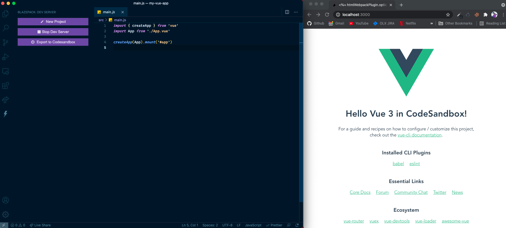

<h1 align="center">Blazepack ⚡</h1>

  Blazing fast dev server powered by <a href="https://www.npmjs.com/package/smooshpack">sandpack</a>

## Usage

- Run `Cmd + P` on Mac or `Ctrl + P` on Windows and linux
- Enter the command `> Start Dev Server` to start the dev server
- Enter the command `> Stop Dev Server` to stop the dev server
- Enter the command `> Export Codesandbox` to export to codesandbox.io

## Thanks 🙏

Icons made by [Smashicons](https://smashicons.com/ "Smashicons") from [www.flaticon.com](https://www.flaticon.com/ "Flaticon")

## License

MIT © [Ameer Jhan](https://github.com/ameerthehacker)
